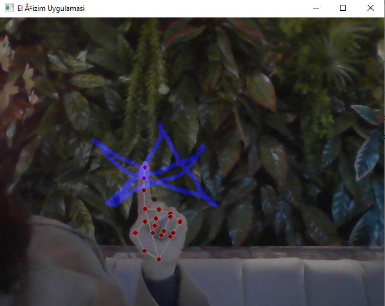
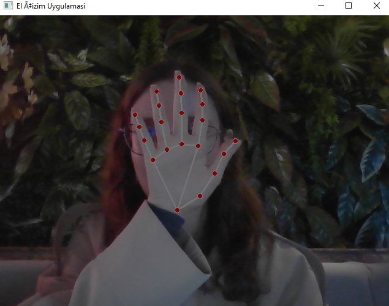

# El Çizim Projesi (Hand Drawing with MediaPipe & OpenCV)

Bu proje, **MediaPipe** ve **OpenCV** kütüphaneleri kullanılarak geliştirilmiş bir **el hareketiyle çizim uygulamasıdır**.  
Kullanıcının el hareketlerini kamera aracılığıyla algılar ve parmak pozisyonlarına göre dijital tuval üzerinde gerçek zamanlı çizim yapılmasını sağlar.

---

## Proje Amacı
Bilgisayarla görme (Computer Vision) alanında **el takibi (hand tracking)** ve **jest tanıma (gesture recognition)** tekniklerini uygulayarak,  
kamera üzerinden doğal kullanıcı etkileşimini (**Natural User Interaction**) simüle etmektir.  
Bu proje, temel **MediaPipe Hands API** ve **OpenCV çizim fonksiyonlarının** entegrasyonuna örnektir.

---

## Özellikler
- **Gerçek zamanlı el tespiti** (MediaPipe Hands)
- **İşaret parmağıyla çizim yapma**
- **Başparmak ve işaret parmağı yakınken çizimi durdurma (silgi modu)**
- **C tuşu ile ekranı temizleme**
- **ESC tuşu ile uygulamadan çıkış**
- **Renk ve kalınlık değiştirilebilir (isteğe göre genişletilebilir)**

---

## Kullanım Kılavuzu

 **İşaret Parmağı**  Çizim yapmak için kullanılır. Parmağını hareket ettirerek ekranda çizim yapabilirsin. 
 **Başparmak + İşaret Parmağı yakınsa** Çizimi durdurur (sanki kalemi kaldırmışsın gibi davranır). 
 **C**  Ekranı temizler (tüm çizimleri siler). 
 **E**  Rengi siyah yapar — silgi gibi davranır. 
 **B**  Rengi mavi yapar (çizim moduna geçer). 
 **ESC**  Uygulamayı kapatır. 

---

## 🎮 Çalışma Prensibi

1. **Kamera Açılır:** `OpenCV` ile görüntü alınır.  
2. **El Tespiti:** `MediaPipe Hands` modülü, el ve parmak noktalarını algılar.  
3. **Koordinatlar İzlenir:** İşaret parmağı ucunun (index finger tip) koordinatları belirlenir.  
4. **Çizim:** Parmağın hareketine göre ekranda çizgi çizilir (`cv2.line`).  
5. **Tuşlar:** Kullanıcı klavye üzerinden renk ve mod değiştirir.  

---

## 🖼️ Örnek Görseller

Aşağıdaki görüntüler uygulamanın çalışma anından alınmıştır:

  



## Kullanılan Teknolojiler
  **Python 3.10**
  **OpenCV** 
  **MediaPipe** 
  **NumPy**

---

## 🖥️ Kurulum ve Çalıştırma
```bash
# Gerekli kütüphaneleri yükle
pip install mediapipe opencv-python numpy

# Projeyi başlat
python cizim.py

---

## 💡 Proje Özeti (Kısa Tanıtım)

Bu proje, **MediaPipe** ve **OpenCV** kullanarak geliştirilen, **el hareketleriyle etkileşimli çizim uygulamasıdır**.  
Kullanıcı, kamera aracılığıyla el hareketlerini kullanarak ekranda çizim yapabilir, silgi moduna geçebilir veya renk değiştirebilir.  
Proje, bilgisayarla görü (computer vision) ve doğal kullanıcı etkileşimi (natural user interaction) konularında temel bir örnektir.

---

## 🌍 Project Summary (English)

This project is an **interactive hand-drawing application** built using **MediaPipe** and **OpenCV**.  
It allows users to draw on the screen in real time using their hand gestures captured by the webcam.  
The project demonstrates a simple integration of **computer vision** and **gesture-based interaction** concepts.

---

👩‍💻 **Developer:** [@S14E5iN](https://github.com/S14E5iN)  
📅 **Created:** 2025  
🧠 **Tech Stack:** Python, MediaPipe, OpenCV, NumPy  
🎯 **Goal:** Bridging the gap between human gestures and digital interaction
